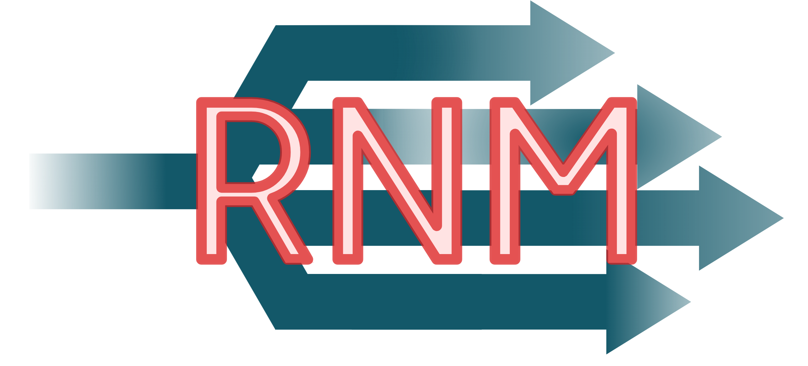

# rnm-go



REALITY Name Multiplexer, port mutiplexer for REALITY

### Intro

You can use rnm-go to reuse single port to forward to multiple REALITY servers.

It is suitable for relay servers with a limited number of ports.

Consider the following:

> \- 淦，65533 个端口都被墙🧱了！<br/>
> \- rnm，go！<br/>

```bash
                                                   |------> REALITY Destination 1
                                                   |------> REALITY Destination 2
Client --> Single Port --> Validator / Multiplexer |------> REALITY Destination 3
                                                   |------> REALITY Destination 4
                                                   |------> Fallback Destination
```

### Usage

```shell
./rnm-go -conf config.json
```

Refer to `config.example.json`

### Related projects

- [Qv2ray/mmp-go](https://github.com/Qv2ray/mmp-go) Mega Multiplexer, port mutiplexer for shadowsocks
- [XTLS/REALITY](https://github.com/XTLS/REALITY) Censorship-resistant, fully emulated TLS protocol

### Thanks to:

- Qv2ray Developer Community
- Project X
